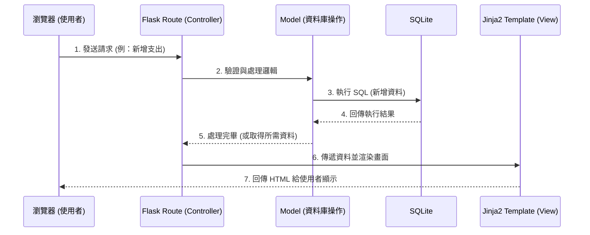

# 系統架構文件 (Architecture)

這份文件基於 [PRD.md](PRD.md) 的需求，規劃了「個人記帳系統」的技術架構與資料夾結構。

## 1. 技術架構說明

### 選用技術與原因
- **後端框架：Python + Flask**
  - 原因：Flask 輕量、靈活，適合快速開發中小型網頁應用。對於記帳系統的核心邏輯（如計算餘額、分類統計），Python 提供了極好的支援。
- **模板引擎：Jinja2**
  - 原因：內建於 Flask 中，可以直接在 HTML 裡面使用 Python 變數與邏輯（如迴圈、條件判斷），因為本專案不需要前後端分離，Jinja2 是伺服器渲染 (SSR) 的最佳選擇。
- **資料庫：SQLite**
  - 原因：零設定、輕量級關聯式資料庫。所有資料以單一檔案格式儲存，非常適合個人記帳這種資料量不大、且主要在單機環境執行的應用程式。

### Flask MVC 模式說明
本專案採用類似 MVC (Model-View-Controller) 的架構來組織程式碼：
- **Model (資料模型)**：負責定義資料結構與操作 SQLite 資料庫（例如新增收支紀錄、查詢餘額）。
- **View (視圖)**：負責呈現使用者介面。在這個專案中，View 就是 Jinja2 渲染出來的 HTML 模板與 CSS 樣式。
- **Controller (控制器)**：在 Flask 中，Controller 就是定義在 `routes` 中的路由函式。它負責接收使用者的請求 (例如表單提交)，呼叫 Model 處理資料，最後將結果丟給 View 去渲染。

## 2. 專案資料夾結構

以下是本專案推薦的資料夾結構與各元件職責說明：

```text
web_app_development/
├── app/                  # 應用程式主目錄
│   ├── models/           # (Model) 資料庫模型與資料操作邏輯
│   │   └── record.py     # 收支紀錄的資料表定義與操作
│   ├── routes/           # (Controller) Flask 路由與商業邏輯
│   │   └── main.py       # 定義如首頁、新增收支等路由
│   ├── templates/        # (View) Jinja2 HTML 模板
│   │   ├── base.html     # 共用版型 (包含導覽列、載入 CSS/JS 等)
│   │   └── index.html    # 首頁 (顯示圖表、餘額與歷史清單)
│   └── static/           # 靜態資源 (前端檔案)
│       ├── css/
│       │   └── style.css # 網頁樣式
│       └── js/
│           └── main.js   # 網頁互動邏輯 (如圖表繪製)
├── instance/             # 存放執行期產生的實體檔案
│   └── database.db       # SQLite 資料庫檔案 (不進版控)
├── docs/                 # 專案文件目錄
│   ├── PRD.md            # 產品需求文件
│   └── ARCHITECTURE.md   # 系統架構文件 (本文件)
├── app.py                # 應用程式進入點，負責啟動 Flask 伺服器
└── requirements.txt      # 專案相依的 Python 套件清單 (如 Flask)
```

## 3. 元件關係圖

以下展示了使用者在瀏覽器操作時，系統內部的資料流動方向：



## 4. 關鍵設計決策

1. **採用伺服器端渲染 (SSR)**
   - **原因**：為了快速開發 MVP 並且降低架構複雜度。我們不需要另外架設前端 API 伺服器，直接透過 Flask 路由與 Jinja2 結合，可以在同一個專案內搞定所有畫面跟邏輯。
2. **單一 SQLite 資料庫檔案**
   - **原因**：考慮到這是一個「個人」記帳系統，並不需要處理龐大的併發請求 (Concurrency)。使用 SQLite 能省去架設與維護 MySQL / PostgreSQL 資料庫伺服器的成本，而且方便備份與搬移。
3. **區分 Routes 與 Models 資料夾**
   - **原因**：即便 Flask 允許把所有程式碼寫在同一個 `app.py` 中，但隨著功能增加 (如記帳、分類圖表、儲蓄等)，程式碼會變得難以維護。拆分 `models` 和 `routes` 能夠維持職責單一原則，讓測試與擴充更容易。
