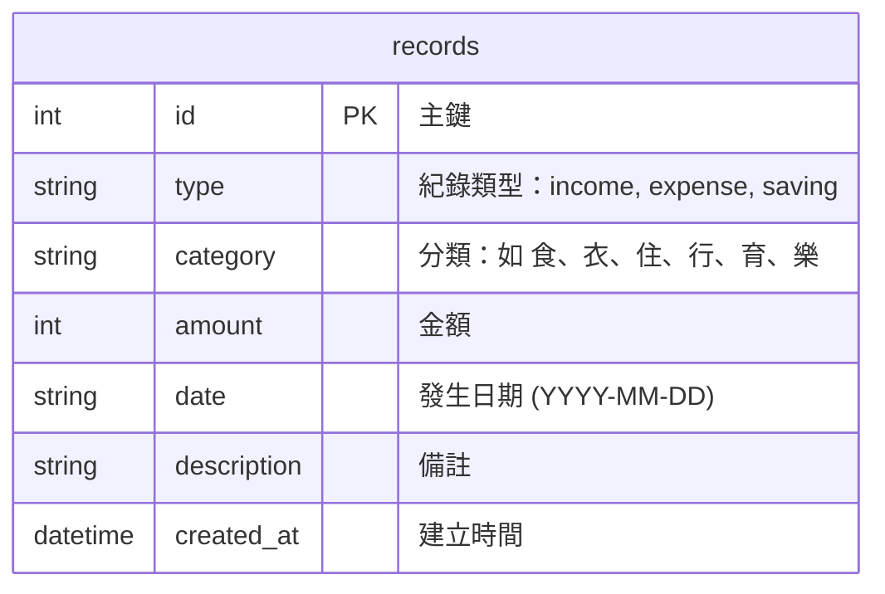

# 資料庫設計文件 (DB Design)

這份文件基於 PRD 與流程圖的需求，定義了個人記帳系統的 SQLite 資料庫結構。

## 1. ER 圖（實體關係圖）

由於這是一個簡單的個人記帳系統，目前我們採用單一資料表 `records` 來統一管理所有的收支與儲蓄紀錄。透過 `type` 欄位來區分紀錄的種類。

## 2. 資料表詳細說明

### 資料表：`records` (收支紀錄表)
此表負責儲存使用者所有的收入、支出與儲蓄紀錄。

| 欄位名稱 | 型別 | 屬性 | 說明 |
| --- | --- | --- | --- |
| `id` | INTEGER | PK, AUTOINCREMENT | 紀錄的唯一識別碼 |
| `type` | TEXT | NOT NULL | 紀錄的類型。允許值：`income` (收入), `expense` (支出), `saving` (儲蓄) |
| `category` | TEXT | NOT NULL | 類別名稱。例如：對於支出為「食」、「衣」等；收入可為「薪水」 |
| `amount` | INTEGER | NOT NULL | 金額。必須大於等於 0 |
| `date` | TEXT | NOT NULL | 紀錄發生的日期，使用 ISO 格式 `YYYY-MM-DD` |
| `description` | TEXT | NULL | 使用者針對該筆紀錄的自訂備註 |
| `created_at` | DATETIME | DEFAULT CURRENT_TIMESTAMP | 該筆資料寫入資料庫的系統時間 |

> **Primary Key (PK)**: `id`
> **Foreign Key (FK)**: 無 (目前無其他關聯資料表)

## 3. SQL 建表語法
完整的建表語法已經儲存至 `database/schema.sql` 中。

## 4. Python Model 程式碼
對應的資料庫操作程式碼已建立於 `app/models/record.py`，使用內建的 `sqlite3` 模組，提供完整的 CRUD (Create, Read, Update, Delete) 以及總計計算等方法。
