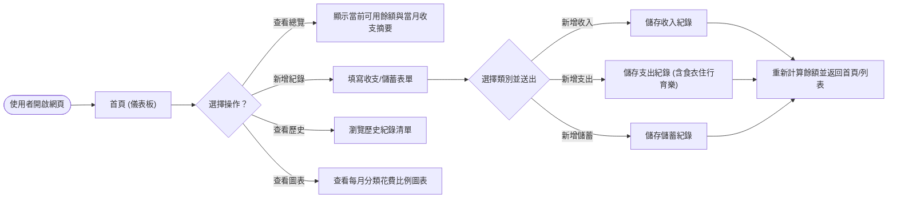
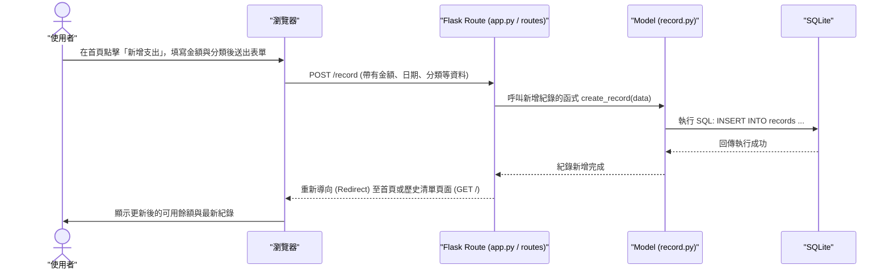

# 流程圖文件 (Flowchart)

這份文件基於 PRD 的需求與系統架構，視覺化了個人記帳系統的使用者操作路徑與系統內部的資料流動。

## 1. 使用者流程圖 (User Flow)

此流程圖展示了使用者在網站上的各種操作路徑，包含新增收支、查看歷史紀錄以及瀏覽圖表分析。

## 2. 系統序列圖 (Sequence Diagram)

此序列圖詳細描述了當使用者「新增一筆支出紀錄」時，系統前後端及資料庫的完整互動流程。

## 3. 功能清單對照表

以下整理了系統中的主要功能，以及預計對應的 URL 路徑與 HTTP 方法：

| 功能名稱 | 對應 URL 路徑 | HTTP 方法 | 說明 |
| --- | --- | --- | --- |
| 總覽儀表板 (首頁) | `/` | GET | 顯示當前可用餘額、最近幾筆紀錄與當月摘要 |
| 顯示新增紀錄表單 | `/record/new` | GET | 顯示填寫收入/支出/儲蓄的 HTML 表單 |
| 送出新增紀錄 | `/record` | POST | 接收表單資料並寫入資料庫 |
| 查看歷史紀錄列表 | `/records` | GET | 列出所有歷史收支紀錄 (可支援分頁或月份篩選) |
| 查看分類花費圖表 | `/analytics` | GET | 顯示各類別支出比例的圓餅圖或長條圖 |
| 刪除單筆紀錄 (擴充功能) | `/record/<id>/delete` | POST | 刪除特定 ID 的收支紀錄 |
